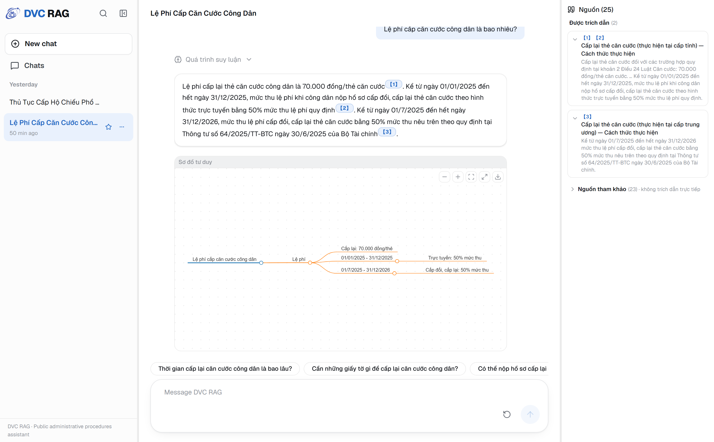
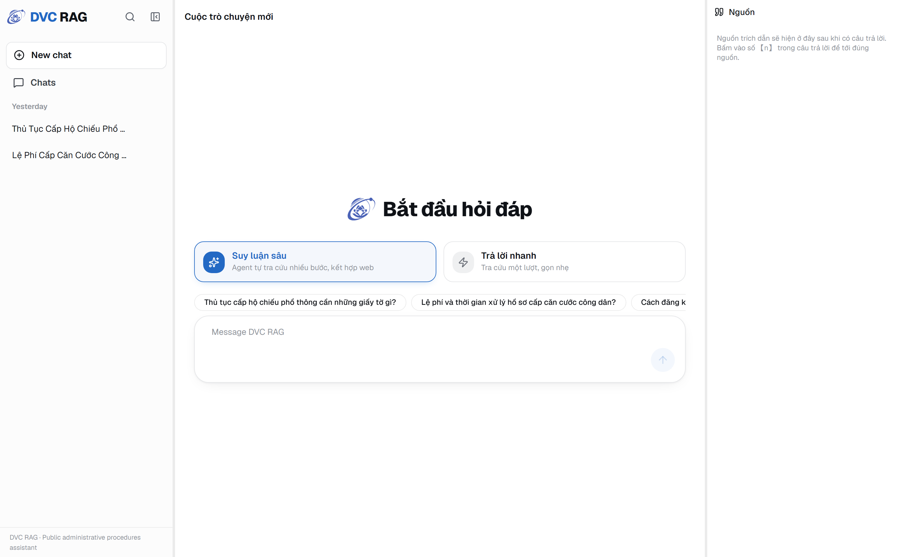
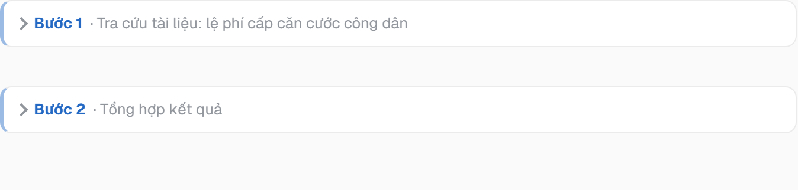
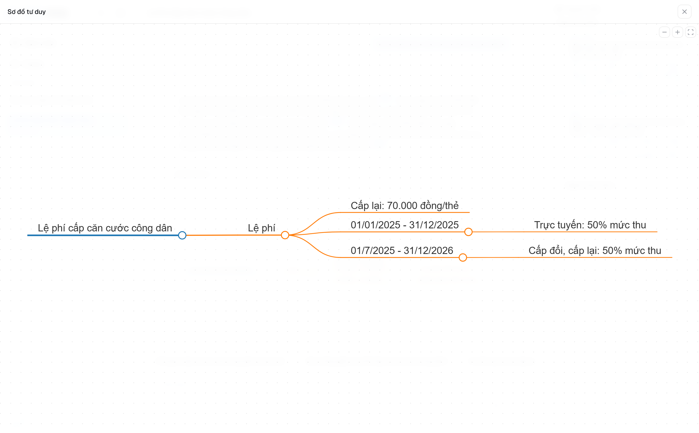

<div align="center">

# 🏛️ Chatbot RAG — Thủ tục hành chính công Việt Nam

**Trợ lý hỏi–đáp về thủ tục hành chính công**, dữ liệu từ [Cổng Dịch vụ công Quốc gia](https://dichvucong.gov.vn),
xây trên nền [kotaemon](https://github.com/Cinnamon/kotaemon) + Azure OpenAI.


[📖 **Hướng dẫn cài đặt (trang HTML)**](docs/index.html) · [🖼️ Giao diện](#-giao-diện) · [🧩 Kiến trúc](#-kiến-trúc) · [⚡ Cài đặt nhanh](#-cài-đặt-nhanh) · [🛠️ Xử lý sự cố](#️-xử-lý-sự-cố)

<br/>



</div>

---

## ✨ Tổng quan

Chatbot trả lời câu hỏi về thủ tục hành chính (hồ sơ, lệ phí, trình tự, thời hạn, cơ quan thực hiện…) dựa trên
kho **5.208 thủ tục** đã lập chỉ mục theo kiến trúc **RAG** (Retrieval-Augmented Generation). Mỗi câu trả lời có
trích dẫn `【n】` dẫn về đúng đoạn nguồn — bấm vào là nhảy tới tài liệu gốc.

> [!NOTE]
> **Toàn bộ code nằm trong repo này** — kể cả thư viện kotaemon đã chỉnh (vendor trong `app/libs/`).
> Clone là có đủ code, **không** phải clone kotaemon rồi copy file cấu hình. Chỉ cần: cài deps → tải index → điền `.env` → chạy.

| Thành phần | Công nghệ |
|---|---|
| **Embedding** | Azure `text-embedding-3-large` (3072 chiều) |
| **LLM** | Azure OpenAI `gpt-4o` |
| **RAG framework** | kotaemon — Chroma (vector) + LanceDB (BM25), hybrid retrieval, rerank bằng LLM |
| **Reasoning** | **ReAct Agent** (mặc định, đa bước) hoặc **Trả lời nhanh** (một lượt) |
| **Web fallback** | Brave Search API (tuỳ chọn, cần `BRAVE_API_KEY`) |
| **Backend / Frontend** | FastAPI (SSE) · React 19 + Vite 5 + Tailwind 4 |

---

## 📚 Mục lục

- [Giao diện](#-giao-diện)
- [Tính năng](#-tính-năng)
- [Ví dụ truy vấn phức tạp](#-ví-dụ-truy-vấn-phức-tạp)
- [Kiến trúc](#-kiến-trúc)
- [Yêu cầu](#-yêu-cầu)
- [Cài đặt nhanh](#-cài-đặt-nhanh)
- [Cài đặt chi tiết](#-cài-đặt-chi-tiết-máy-mới)
- [Chạy ứng dụng](#-chạy-ứng-dụng)
- [Chế độ suy luận](#-chế-độ-suy-luận)
- [Xây index từ đầu](#-xây-index-từ-đầu-tuỳ-chọn)
- [Xử lý sự cố](#️-xử-lý-sự-cố)

---

## 🖼️ Giao diện

<p align="center">
  <br/>
  <sub><b>Màn hình bắt đầu</b> — chọn chế độ (Suy luận sâu / Trả lời nhanh) + gợi ý câu hỏi</sub>
</p>

<p align="center">
  <br/>
  <sub><b>Các bước suy luận có tên</b> — hiển thị hành động + truy vấn của agent ở mỗi bước</sub>
</p>

<p align="center">
  <br/>
  <sub><b>Sơ đồ tư duy</b> toàn màn hình — phóng to / vừa khung / tải <code>.svg</code></sub>
</p>

> Ảnh chụp từ giao diện React thật (panel **Nguồn** bên phải, trích dẫn `【n】` bấm được, khung câu trả lời tách biệt).

---

## 🚀 Tính năng

| | Tính năng | Mô tả |
|---|---|---|
| 🔎 | **Hybrid retrieval** | Chroma (vector) + LanceDB (BM25), rerank bằng LLM trước khi trả lời. |
| 🧠 | **2 chế độ suy luận** | ReAct agent đa bước (tự tra cứu, kết hợp web) hoặc Trả lời nhanh một lượt. |
| 📌 | **Trích dẫn truy vết** | Câu trả lời chèn `【n】`; **bấm vào** → panel Nguồn mở & cuộn tới đúng tài liệu, làm nổi viền. |
| 🧩 | **Các bước suy luận có tên** | "Tra cứu tài liệu: …", "Tìm kiếm web: …", "Tổng hợp kết quả" — không còn chỉ là id tool. |
| 🗺️ | **Sơ đồ tư duy** | Mindmap markmap có toolbar: phóng to / vừa khung / **toàn màn hình** / tải `.svg`. |
| 🗂️ | **Panel nguồn gọn** | Nguồn được trích dẫn hiện trực tiếp; nguồn tham khảo nhiều thì **tự thu gọn** (không tràn). |
| 💬 | **Tiêu đề tự đặt** | Đoạn chat tự sinh tên ngắn gọn từ câu hỏi đầu tiên (LLM, có fallback). |
| 💾 | **Lưu & khôi phục** | Suy luận + nguồn được lưu theo từng lượt; mở lại hội thoại là thấy đầy đủ. |
| 🌐 | **Web fallback** | Khi corpus không có dữ liệu, ReAct tự tìm Brave Search và gắn nhãn 🌐 (chưa thẩm định). |

---

## 🎯 Ví dụ truy vấn phức tạp

ReAct Agent xử lý được câu hỏi cần **nhiều bước tra cứu + suy luận**. Cơ chế: tách câu hỏi phức thành các câu con
(planner) → tra riêng từng câu → gom nguồn, kiểm chứng grounding → tổng hợp một lần có trích dẫn `【n】`.

| Câu hỏi | Khả năng minh hoạ |
|---|---|
| *“Tôi 16 tuổi, mất hộ chiếu cũ, cần giấy tờ gì và **ai nộp thay** được?”* | **Phân nhánh điều kiện** — tách 2 nhánh, trả lời đúng theo độ tuổi (16 > 14 nên tự nộp được, hoặc người đại diện ký thay). |
| *“Để mở **trường mầm non tư thục**, phải qua thủ tục nào, **mỗi thủ tục mất bao lâu**, **tổng chi phí**?”* | **Tổng hợp đa khía cạnh** — tách 3 khía cạnh, tra riêng; **trung thực** nói rõ phần không có dữ liệu thay vì bịa. |
| *“Làm hộ chiếu ở **Phòng QLXNC CA TP.HCM** thì địa chỉ, giờ làm việc, SĐT?”* | **Web fallback** — corpus chỉ nói chung cấp tỉnh → tự tìm Brave bổ sung, gắn nhãn 🌐. |
| *“**So sánh** hồ sơ & lệ phí hộ chiếu **gắn chip** vs **không gắn chip**?”* | **Chống so sánh giả** — nhận ra dữ liệu chỉ có một loại, không dựng hai cột khác nhau từ cùng bộ tài liệu. |

---

## 🧩 Kiến trúc

Sau khi cài xong, máy có **hai phần tách biệt**: repo code (git) và index dữ liệu (ngoài git, tải từ HuggingFace).

```
du-an/                          ← REPO (git): code + scripts (~vài chục MB)
├── pipeline/                   ❶ Thu thập & xử lý dữ liệu → corpus
│   ├── crawler/crawl.py        #   dichvucong.gov.vn → data/raw/*.json
│   └── parser/parse.py         #   JSON → data/corpus/md/*.md (+ chunks.jsonl)
├── rag/                        ❷ Code RAG của dự án (wiring kotaemon)
│   ├── prompts.py              #   Prompt tiếng Việt (QA / rewrite / ReAct / mindmap / title)
│   ├── agent_tools.py          #   BraveSearchTool (web fallback)
│   ├── flowsettings.py         #   Cấu hình kotaemon (Azure embed 3072d, lang=vi)
│   ├── ingest_corpus.py        #   Nạp corpus → vector/doc store
│   └── query_test.py           #   Test RAG headless
├── app/                        ❸ kotaemon đã vendor + tầng API
│   ├── api/                    #   FastAPI (stream SSE) — backend của UI React
│   ├── app.py                  #   Launcher Gradio (UI phụ)
│   └── libs/{kotaemon,ktem}    #   thư viện đã vá
├── frontend/                   ❹ UI React (Vite + React 19 + Tailwind 4) — demo chính
├── scripts/                    ❺ init_index.py / pack_index.py (chia sẻ index qua HF)
├── docs/index.html             📖 Trang hướng dẫn cài đặt (mở bằng trình duyệt)
├── .env                        ← bạn tự điền Azure key (gitignore)
└── constraints.txt             # Pin phiên bản deps

C:\ktem_data\                   ← INDEX (ngoài repo): tải/giải nén từ HF (~1.5 GB)
└── user_data/
    ├── vectorstore/<uuid>/     Chroma HNSW (≈33k vector × 3072 chiều)
    ├── docstore/index_1.lance  LanceDB: text các chunk + FTS (BM25)
    ├── files/index_1/          bản .md gốc đã ingest
    └── sql.db                  metadata ktem (index__1__source = 5208 thủ tục)
```

> [!IMPORTANT]
> Index trong `C:\ktem_data` **không** nằm trong git — nó đến từ HuggingFace (đóng gói bởi `pack_index.py`,
> mở bởi `init_index.py`). Code repo và index là hai nguồn độc lập: đổi quy tắc parse/chunk thì phải
> **re-ingest + đóng gói lại** mới khớp.

---

## ✅ Yêu cầu

- **Windows** (Linux/HF Spaces chưa kiểm thử HNSW binary — xem [Xử lý sự cố](#️-xử-lý-sự-cố))
- **Python 3.10** · **[uv](https://github.com/astral-sh/uv)** (`pip install uv`)
- **Node.js ≥ 20** kèm `npm` (đã test Node 22 / npm 10)
- **git**
- **Tài khoản Azure OpenAI** với 2 deployment: `gpt-4o` + `text-embedding-3-large`
- *(tuỳ chọn)* **Brave Search API** cho web fallback

---

## ⚡ Cài đặt nhanh

> 📖 Hướng dẫn đầy đủ, có copy-code & xử lý sự cố: mở **[`docs/index.html`](docs/index.html)** bằng trình duyệt.

```powershell
# 1. Clone & môi trường ảo
git clone <url-repo> "du-an"; cd "du-an"
python -m venv .venv
.venv\Scripts\python.exe -m pip install -U pip uv

# 2. Dependencies (dùng uv — KHÔNG pip)
.venv\Scripts\uv.exe pip install --python .venv\Scripts\python.exe `
  --constraint constraints.txt `
  -e "app/libs/kotaemon" -e "app/libs/ktem" `
  fastembed "onnxruntime<1.20" "unstructured>=0.15.8,<0.16" tabulate cachetools

# 3. .env  → điền AZURE_OPENAI_* (xem mục dưới)
copy .env.example .env

# 4. Tải index đã embed từ HuggingFace (~728 MB)
.venv\Scripts\python.exe scripts\init_index.py --hf-repo MinhTriet/dvc-rag-embeddings

# 5. UI React
cd frontend; npm install; cd ..

# 6. Chạy (2 terminal) — hoặc dùng .\run-backend.ps1 / .\run-frontend.ps1
.venv\Scripts\python.exe -m uvicorn app.api.main:app --port 8000     # Terminal 1
cd frontend; npm run dev                                             # Terminal 2 → :5173
```

→ Mở **http://127.0.0.1:5173**. *(Phải chạy backend trước.)*

---

## 🔧 Cài đặt chi tiết (máy mới)

### Bước 3 — Cấu hình `.env`

```dotenv
AZURE_OPENAI_ENDPOINT=https://<resource>.openai.azure.com/
AZURE_OPENAI_API_KEY=<key>
AZURE_OPENAI_CHAT_DEPLOYMENT=gpt-4o
AZURE_OPENAI_EMBEDDINGS_DEPLOYMENT=text-embedding-3-large

# Đã có sẵn — KHÔNG đổi (xem lưu ý path ASCII bên dưới):
KH_APP_DATA_DIR=C:\ktem_data

# Tuỳ chọn — bật web fallback cho ReAct agent (để trống = tắt):
BRAVE_API_KEY=<key tại https://brave.com/search/api/>
```

### Bước 4 — Tải index

Script tải `ktem_index.tar.gz`, giải nén vào `C:\ktem_data`, rồi kiểm tra hợp lệ (số tài liệu = 5208, kích thước HNSW, trạng thái `.env`).

```powershell
# Kiểm tra index bất kỳ lúc nào (không tải lại):
.venv\Scripts\python.exe scripts\init_index.py --verify

# Có file thủ công thay vì tải từ HF:
.venv\Scripts\python.exe scripts\init_index.py --from C:\path\to\ktem_index.tar.gz
```

> [!TIP]
> Script Python in tiếng Việt cần UTF-8 console: đặt `$env:PYTHONUTF8=1` trước khi chạy.
> Các script `run-*.ps1` đã set sẵn.

---

## ▶️ Chạy ứng dụng

Demo chính là **UI React**, cần **2 tiến trình song song** (mỗi cái một terminal, từ gốc repo):

```powershell
# Terminal 1 — Backend API (FastAPI) · Swagger: http://127.0.0.1:8000/docs
.venv\Scripts\python.exe -m uvicorn app.api.main:app --port 8000

# Terminal 2 — Frontend (Vite dev) → http://127.0.0.1:5173
cd frontend
npm run dev
```

Vite tự proxy `/api` → `:8000` (không lo CORS). **Phải chạy backend trước.**

<details>
<summary><b>Bản host LAN (build tĩnh, cho máy khác truy cập)</b></summary>

```powershell
# Terminal 1 — vẫn cần backend
.venv\Scripts\python.exe -m uvicorn app.api.main:app --port 8000
# Terminal 2 — build + preview (port 4173)
cd frontend; npm run build; npm run preview      # → http://<IP-máy>:4173
```
Bản `preview` (đã build) nhanh hơn `npm run dev` nhiều (dev có StrictMode render gấp đôi + chưa minify).
</details>

<details>
<summary><b>UI Gradio & test headless (phụ)</b></summary>

```powershell
.venv\Scripts\python.exe app\app.py                                  # Gradio → :7860
.venv\Scripts\python.exe rag\query_test.py "Hồ sơ đăng ký khai sinh gồm những gì?"
```
</details>

> [!NOTE]
> `uvicorn` không bật `--reload`: sửa code backend hoặc **ingest lại corpus** → phải **restart uvicorn** để nạp lại vector store vào RAM.

---

## 🧠 Chế độ suy luận

Chọn ngay ở màn hình hội thoại mới (hoặc **Settings → Reasoning**):

| Chế độ | Engine | Khi nào dùng |
|---|---|---|
| ✨ **Suy luận sâu** *(mặc định)* | `ReAct` | Câu hỏi phức tạp, nhiều bước, so sánh, kết hợp web. Tách câu hỏi con → tra riêng → tổng hợp có trích dẫn. |
| ⚡ **Trả lời nhanh** | `simple` | Câu hỏi đơn, một lượt tra cứu, gọn nhẹ. |

---

## 🏗️ Xây index từ đầu (tuỳ chọn)

```powershell
.venv\Scripts\python.exe pipeline\crawler\crawl.py            # 1. Crawl  → data/raw/*.json (~5208)
.venv\Scripts\python.exe pipeline\parser\parse.py             # 2. Parse  → data/corpus/md/*.md
.venv\Scripts\python.exe rag\fast_ingest.py --workers 10      # 3. Ingest → C:\ktem_data (song song)
.venv\Scripts\python.exe scripts\pack_index.py --hf-repo MinhTriet/dvc-rag-embeddings --hf-token hf_xxx   # 4. Đóng gói + chia sẻ
```

---

## 🛠️ Xử lý sự cố

> [!WARNING]
> **Đường dẫn phải ASCII (Windows).** Giữ `KH_APP_DATA_DIR=C:\ktem_data`. Nếu index nằm trong thư mục tên
> tiếng Việt, `hnswlib` không tạo được file `.bin` → **toàn bộ vector mất sau ingest mà không báo lỗi**.

| Triệu chứng | Khắc phục |
|---|---|
| `UnicodeEncodeError` / `charmap` khi chạy script | Console cp1252 — đặt `$env:PYTHONUTF8=1`. |
| Frontend báo lỗi gọi máy chủ / trắng trang | Chưa chạy backend hoặc sai thứ tự. Mở `:8000/docs` kiểm tra trước. |
| Câu trả lời không đổi sau khi ingest lại | Restart `uvicorn` để nạp lại vector store. |
| Sửa code backend không có tác dụng | `uvicorn` không bật `--reload` → restart tiến trình. |
| Tiến trình ingest treo sau khi kill | `Remove-Item -Recurse -Force "$env:TEMP\claude\theflow_$env:USERNAME"` |
| Chuyển hội thoại thấy chậm | Dev server chậm hơn bản build; dùng `npm run build && npm run preview` để đánh giá thật. |

> [!NOTE]
> **Bản vá kotaemon nằm trong `app/libs/`** (đã commit): `private=false` lưu trong index; vá FTS LanceDB chống
> Rust panic; prompt tiếng Việt tách ra `rag/prompts.py`. Vì vendor sẵn nên clone máy mới **không tái phát** các lỗi này.
>
> **Linux / HF Spaces:** HNSW binary chưa kiểm thử cross-platform. Deploy Linux cần đặt `KH_APP_DATA_DIR=/ktem_data`
> và kiểm tra file `.bin` đọc được.

---

<div align="center">
<sub>Dữ liệu thuộc Cổng Dịch vụ công Quốc gia — dùng cho mục đích học tập/nghiên cứu · Xây trên <a href="https://github.com/Cinnamon/kotaemon">kotaemon</a></sub>
</div>
